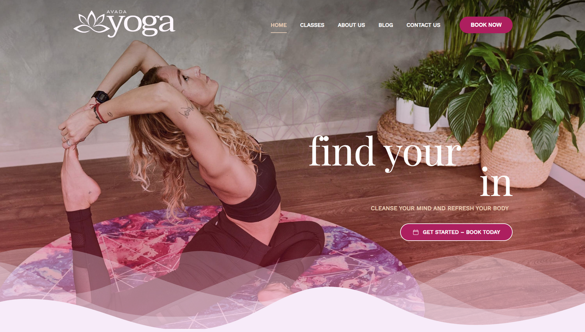
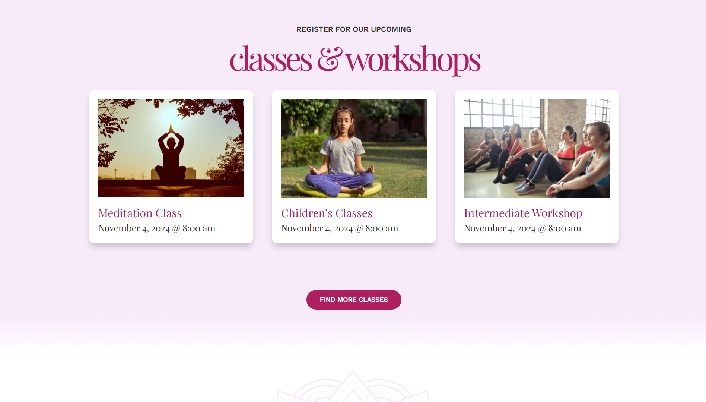
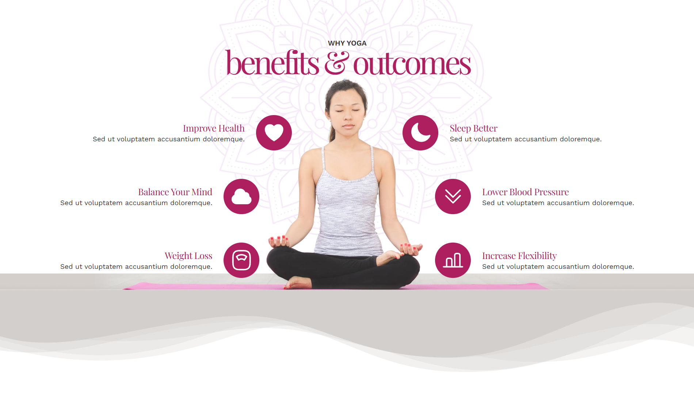
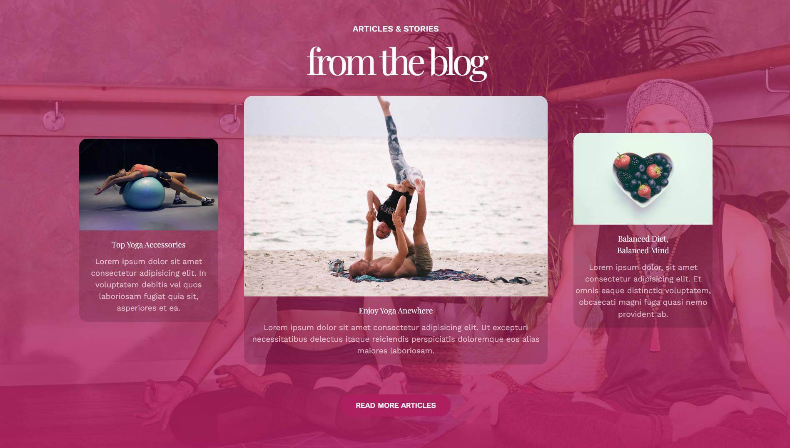

# Yoga

# 🧘 Avada Yoga - Blog Template

A professional website template for yoga centers and yoga classes, built with pure HTML and CSS.

**[🔗 Live Demo](https://arashazarii.github.io/yoga/)**

---

## ✨ About This Project

Avada Yoga is a modern and responsive website template for anyone who wants to establish a professional online presence in the yoga world. This project was developed as the **author's first HTML/CSS project**, completed **solo in just 3 days**.

### 📋 Features

- ✅ **Fully Responsive** - Compatible with all screen sizes (mobile, tablet, desktop)
- 🎨 **Modern Design** - Clean and attractive colors and typography
- 🚀 **Fast & Lightweight** - No dependencies or external frameworks
- 📱 **Mobile-First** - Priority design approach for mobile devices
- 🎯 **Clean Code** - Well-organized and easy to understand

---

## 📑 Template Sections

The template includes the following sections:

1. **Home Page** - Quick introduction and CTA for booking classes
2. **Classes & Workshops** - Display of available classes and workshops
3. **Yoga Benefits** - 6 key benefits of practicing yoga
4. **Instructors** - Introduction of qualified yoga instructors
5. **Blog** - Articles and useful tips about yoga
6. **Contact** - Contact form and company information

---

## 🛠 Technologies Used

- **HTML5** - Semantic structure and markup
- **CSS3** - Styling and responsive design

---

## 🚀 Installation & Usage

### Quick Start

1. **Clone the repository:**
```bash
git clone https://github.com/Arashazarii/yoga.git
```

2. **Navigate to the folder:**
```bash
cd yoga
```

3. **Open the `index.html` file:**
   - Double-click the `index.html` file, or
   - Use a Live Server (e.g., VS Code Live Server Extension)

### Using Live Server (Recommended)

If you have VS Code installed:
1. Install the `Live Server` extension
2. Right-click on `index.html` → `Open with Live Server`

---

## 📁 Project Structure

```
yoga/
├── index.html           # Main homepage
├── css/
│   ├── style.css       # Main stylesheet
│   └── responsive.css  # Responsive styles
├── assets/
│   └── images/
│       ├── logo/
│       ├── classes/
│       ├── instructors/
│       ├── blogs/
│       └── footer/
├── screenshots/
│   ├── homepage.png
│   ├── classes.png
│   ├── instructors.png
│   └── blog.png
└── README.md           # This file
```

---

## 📸 Screenshots

### Homepage


### Classes Section


### Instructors Section


### Blog Section


---

## 🎯 Project Goals

This project was created as a **learning example** for:
- ✅ Learning HTML5 and semantic markup
- ✅ Practicing CSS and responsive design
- ✅ Understanding UX/UI principles
- ✅ Building a real-world, practical project

---

## 🔄 Future Enhancements

Possible features and improvements to be added:

- [ ] JavaScript functionality (interactive forms, mobile menu)
- [ ] FAQ section
- [ ] Payment gateway integration
- [ ] Online booking system
- [ ] Social media integration
- [ ] Better SEO optimization
- [ ] Dark mode support
- [ ] Multi-language support

---

## 📝 License

This project is licensed under the **MIT License**. See the `LICENSE` file for more details.

---

## 👨‍💻 Author

**Arash Azari** | [GitHub](https://github.com/Arashazarii)

Built with 💜 in 3 days

---

## 📧 Contact & Feedback

If you have any questions or suggestions for improving this project:
- 📨 Feel free to open a GitHub Issue
- 🌟 If you like it, please give it a Star!

---

**Feel free to use this template!** 🎉
